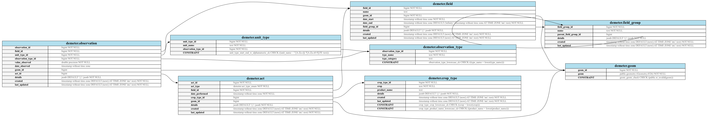

# demeter

The database schema and API that supports agronomic modeling and data science activities.

## Documentation
### [Demeter Postgres Setup](https://sentera.atlassian.net/wiki/spaces/GML/pages/3297148971/Demeter+Setup)
A guide for configuring your project to connect to a `demeter` PostgreSQL database.
- __[Initializing Database Server](https://sentera.atlassian.net/wiki/spaces/GML/pages/3299639330/Initializing+database+server)__
  - Includes Mac and Windows set-up
- __[WSL Setup](https://sentera.atlassian.net/wiki/spaces/GML/pages/3302850561/WSL+Setup)__
  - Contains information about how to set up PostgreSQL and PostGIS on Windows Subsystem for Linux.
  - __[Upgrade GEOS](https://sentera.atlassian.net/wiki/spaces/GML/pages/3302522986/Upgrade+GEOSp)__ 
    - Contains information on upgrading GEOS to GEOS v3.9+ to enable some PostGIS functions.
- __[Connecting to AWS RDS](https://sentera.atlassian.net/wiki/spaces/GML/pages/3301048336/Connecting+to+AWS+RDS)__


## Setup and Installation (for development)
1) [Set up SSH](https://github.com/SenteraLLC/install-instructions/blob/master/ssh_setup.md)
2) Install [pyenv](https://github.com/SenteraLLC/install-instructions/blob/master/pyenv.md) and [poetry](https://python-poetry.org/docs/#installation).
3) Install package
``` bash
git clone git@github.com:SenteraLLC/demeter.git
cd demeter
pyenv install $(cat .python-version)
poetry config virtualenvs.in-project true
poetry env use $(cat .python-version)
poetry install
```
**CAUTION**: On WSL, some dependencies (e.g., psycopg2) return a `ChefBuildError` and fail to install. Installing `libpq-dev` and `python3-dev` should solve this.
``` bash
sudo apt install libpq-dev python3-dev
```
4) Set up `pre-commit` to ensure all commits to adhere to **black** and **PEP8** style conventions.
``` bash
poetry run pre-commit install
```

### Release/Tags
- A GitHub release is created on every push to the main branch using the `create_github_release.yml` Github Action Workflow
- Releases can be created manually through the GitHub Actions UI as well.
- The name of the Release/Tag will match the value of the version field specified in `pyproject.toml`
- Release Notes will be generated automatically and linked to the Release/Tag

## Setup and Installation (used as a library)
If using `demeter` as a dependency in your script, simply add it to the `pyproject.toml` in your project repo. Be sure to uuse the `ssh:` prefix so Travis has access to the repo for the library build process.

<h5 a><strong><code>pyproject.toml</code></strong></h5>

``` toml
[tool.poetry.dependencies]
demeter = { git = "ssh://git@github.com/SenteraLLC/demeter.git", branch = "main"}
```

Install `demeter` and all its dependencies via `poetry install`.

``` bash
poetry install
```

## Requirements
- Python `3.10.4`+
- Access to a Postgres database with appropriate connection credentials (see Documentation above)
- OSX Users may need to manually install the 'gdal' system requirement (e.g. brew install gdal)

## Demeter Data Types
See these Confluence pages for some background on data types and tables that the `demeter` database uses:
- [Demeter Data Types](https://sentera.atlassian.net/wiki/spaces/GML/pages/3172270107/Demeter+Data+Types)
- [Demeter Schema (for v1.2.0)](https://sentera.atlassian.net/wiki/spaces/GML/pages/3198156837/Proposed+Demeter+Schema+v1.2.0+ABI)

## Tests

Before running tests, you must
1) Have a local instance of the `demeter` database with appropriate users created and the `weather` and `demeter` schemas initialized and populated.
  - See `Demeter Postgres Setup` Confluence doc above.
2) Set up the three test permission dictionaries: `TEST_DEMETER_SETUP`, `TEST_DEMETER_RW`, and `TEST_DEMETER_RO`
  - For each dictionary, set `search_path` = `test_demeter,weather,public`.
  - Ask Tyler or Marissa for more details on how to set up permissions for these users.

Then, you can run `pytest` with

```bash
poetry run pytest
```

## Troubleshooting
### Installing `geopandas` on Mac
[See this SO thread](https://stackoverflow.com/questions/71137617/error-installing-geopandas-in-python-on-mac-m1)

## Diagram Generation
Graphviz is required for automatic diagram generation. Ensure `graphviz` is installed (note that it's present in the `dev-dependencies`).

A `schema-demeter.png` can be automatically generated with the following:

```bash
pg_dump --schema-only --schema demeter -h localhost -U postgres -d demeter-dev | poetry run python -m scripts.to_graphviz | dot -Tpng > schema-demeter.png
```


#### Example Schema

